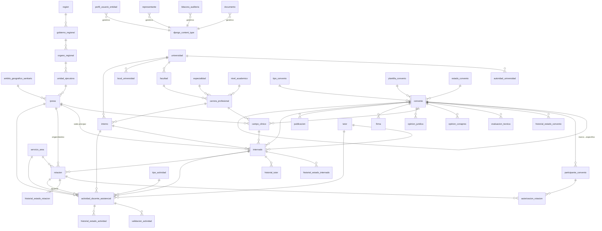

# Diagrama ER Global — RENADS

Diagrama entidad-relación consolidado de los 3 módulos. Las tablas conservan nombres en español; entre paréntesis se indica la clase Django (inglés) y el módulo de origen.

- **M1** = Gestionar Convenios (`convenios`)
- **M2** = Registrar Internados (`internados`)
- **M3** = Registrar Actividades (`actividades`)
- **DJ** = nativo de Django

> Notación: `─<` indica "uno a muchos" (la cresta apunta al lado *muchos*). `┄┄` indica relación **polimórfica** vía `django_content_type`.

---

## 1. Diagrama (Mermaid)



---

## 2. Relaciones polimórficas (vía `django_content_type`)

| Tabla | Apunta a | Propósito |
|-------|----------|-----------|
| `representante` (M1) | `organo_minsa`, `organo_regional`, `unidad_ejecutora`, `ipress`, `conapres` | Representantes/autoridades por jerarquía |
| `perfil_usuario_entidad` (M1) | cualquier entidad organizacional | Vínculo usuario↔entidad↔rol |
| `convenio.solicitante` (M1) | `universidad`, `organo_regional`, … | Entidad solicitante |
| `participante_convenio` (M1) | cualquier entidad | Entidades participantes/firmantes |
| `firma.firmante` (M1) | `organo_minsa`, `universidad`, … | Entidad firmante |
| `documento` (M1) | toda tabla del flujo | Adjuntos PDF (repositorio externo) |
| `bitacora_auditoria` (M1) | cualquier entidad | Auditoría de operaciones críticas |

---

## 3. Puentes entre módulos

```
M1 (conventions)                M2 (internships)              M3 (activities)
────────────────                ────────────────              ───────────────
convenio ───────────────────────> internado
campo_clinico ──────────────────> internado
ipress ─────────────────────────> internado / rotacion ─────> actividad_docente_asistencial
universidad ────────────────────> interno
carrera_profesional ────────────> interno
participante_convenio ──────────> autorizacion_rotacion
                                  interno ────────────────────> actividad_docente_asistencial
                                  internado ──────────────────> actividad_docente_asistencial
                                  tutor / rotacion / servicio_area ──> actividad_docente_asistencial
documento (M1) ─ genérico ──────> [cualquier tabla de M1/M2/M3]
bitacora_auditoria (M1) ─ genérico ─> [cualquier tabla]
```

---

## 4. Mapa apps Django ↔ tablas

| App | Tablas (db_table) |
|-----|-------------------|
| **Gestionar Convenios** (`convenios`, M1) | `ubigeo`, `region`, `ambito_geografico_sanitario`, `tipo_convenio`, `estado_convenio`, `tipo_documento`, `tipo_gestion_universidad`, `tipo_entidad_universidad`, `tipo_autorizacion`, `nivel_academico`, `especialidad`, `tipo_autoridad_firmante`, `tipo_organo_regional`, `tipo_unidad_ejecutora`, `tipo_organo_minsa`, `cargo_ejecutivo`, `motivo_observacion`, `motivo_rechazo`, `motivo_cierre`, `gobierno_regional`, `organo_regional`, `unidad_ejecutora`, `ipress`, `organo_minsa`, `conapres`, `representante`, `universidad`, `autoridad_universidad`, `facultad`, `carrera_profesional`, `local_universidad`, `perfil_usuario_entidad`, `plantilla_convenio`, `convenio`, `participante_convenio`, `historial_estado_convenio`, `evaluacion_tecnica`, `opinion_conapres`, `campo_clinico`, `opinion_juridica`, `firma`, `publicacion`, `documento`, `bitacora_auditoria` |
| **Registrar Internados** (`internados`, M2) | `estado_internado`, `estado_rotacion`, `servicio_area`, `tipo_documento_identidad`, `interno`, `tutor`, `internado`, `historial_estado_internado`, `historial_tutor`, `rotacion`, `autorizacion_rotacion`, `historial_estado_rotacion` |
| **Registrar Actividades** (`actividades`, M3) | `tipo_actividad`, `estado_actividad`, `actividad_docente_asistencial`, `validacion_actividad`, `historial_estado_actividad` |
