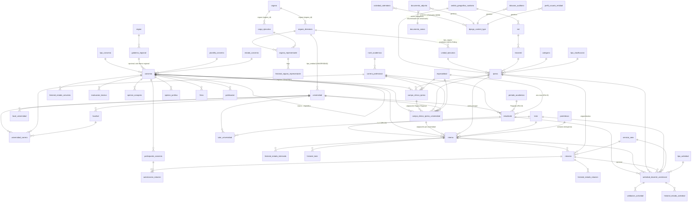

# Diagrama ER Global — RENADS

Diagrama entidad-relación consolidado de los 3 módulos. Las tablas conservan nombres en español; entre paréntesis se indica la clase Django (inglés) y el módulo de origen.

- **M1** = Gestionar Convenios (`convenios`)
- **M2** = Registrar Internados (`internados`)
- **M3** = Registrar Actividades (`actividades`)
- **M4** = Calendario administrativo (`calendario`)
- **DJ** = nativo de Django

> Notación: `─<` indica "uno a muchos" (la cresta apunta al lado *muchos*). `┄┄` indica relación **polimórfica** vía `django_content_type`.

---

## 1. Diagrama (Mermaid)


```mermaid
erDiagram
    %% ===== Catálogos clave =====
    region ||--o{ gobierno_regional : ""
    ambito_geografico_sanitario ||--o{ ipress : ""

    %% ===== M1: Jerarquía GORE =====
    %% organo_directorio referencia su categoría vía FK `organo` (organo_id, migración 0039).
    %% El GORE del convenio vive en `convenio.gobierno_regional` (solo Marco regional).
    organo ||--o{ organo_directorio : "organo (organo_id)"
    organo_directorio ||--o{ unidad_ejecutora : "tipo_organo (UNIDAD_EJECUTORA)"
    organo_directorio ||--o{ universidad : "tipo_entidad (UNIVERSIDAD)"
    unidad_ejecutora ||--o{ ipress : ""

    %% ===== M1: Jerarquía Red/Microred y clasificación de IPRESS =====
    ambito_geografico_sanitario ||--o{ red : ""
    red ||--o{ microred : ""
    microred ||--o{ ipress : ""
    categoria ||--o{ ipress : ""
    tipo_clasificacion ||--o{ ipress : ""

    %% ===== M1: Representantes de órgano =====
    organo_directorio ||--o{ organo_representante : ""
    cargo_ejecutivo ||--o{ organo_representante : ""
    organo_representante ||--o{ historial_organo_representante : "baja"
    organo ||--o{ cargo_ejecutivo : "organo (organo_id)"

    %% ===== M1: Universidad =====
    universidad ||--o{ facultad : ""
    universidad ||--o{ local_universidad : ""
    universidad ||--o{ universidad_carrera : ""
    carrera_profesional ||--o{ universidad_carrera : ""
    facultad ||--o{ universidad_carrera : ""
    nivel_academico ||--o{ carrera_profesional : ""

    %% ===== M1: Convenio =====
    tipo_convenio ||--o{ convenio : ""
    gobierno_regional ||--o{ convenio : "opcional, solo Marco regional"
    convenio ||--o{ convenio : "marco→especifico"
    plantilla_convenio ||--o{ convenio : ""
    estado_convenio ||--o{ convenio : ""
    convenio ||--o{ participante_convenio : ""
    convenio ||--o{ historial_estado_convenio : ""
    convenio ||--o{ evaluacion_tecnica : ""
    convenio ||--o{ opinion_conapres : ""
    convenio ||--o{ campo_clinico_ipress : "registro CONAPRES"
    convenio ||--o{ campo_clinico_ipress_universidad : ""
    campo_clinico_ipress ||--o{ campo_clinico_ipress_universidad : "asignación Órgano Regional"
    convenio ||--o{ opinion_juridica : ""
    convenio ||--o{ firma : ""
    convenio ||--o{ publicacion : ""
    ipress ||--o{ campo_clinico_ipress : ""
    carrera_profesional ||--o{ campo_clinico_ipress : ""
    especialidad ||--o{ campo_clinico_ipress : ""
    ipress ||--o{ campo_clinico_ipress_universidad : ""
    carrera_profesional ||--o{ campo_clinico_ipress_universidad : ""
    especialidad ||--o{ campo_clinico_ipress_universidad : ""
    universidad ||--o{ campo_clinico_ipress_universidad : ""

    %% ===== M2: Internado =====
    estudiante ||--o{ interno : ""
    convenio ||--o{ interno : ""
    campo_clinico_ipress_universidad ||--o{ interno : "asignación por universidad"
    ipress ||--o{ interno : "sede principal"
    tutor ||--o{ interno : ""
    universidad ||--o{ estudiante : ""
    universidad ||--o{ tutor_universidad : ""
    tutor ||--o{ tutor_universidad : "1 a 2 (RN-24)"
    carrera_profesional ||--o{ estudiante : ""
    parentesco ||--o{ interno : "contacto emergencia"
    periodo_academico ||--o{ estudiante : "Pregrado (RN-19)"
    especialidad ||--o{ estudiante : "otro nivel (RN-19)"
    interno ||--o{ historial_estado_internado : ""
    interno ||--o{ historial_tutor : ""
    interno ||--o{ rotacion : ""
    ipress ||--o{ rotacion : "origen/destino"
    servicio_area ||--o{ rotacion : ""
    rotacion ||--o{ autorizacion_rotacion : ""
    participante_convenio ||--o{ autorizacion_rotacion : ""
    rotacion ||--o{ historial_estado_rotacion : ""
    %% Catálogo maestro de documentos requeridos por actor (interno / representante — cubre
    %% autoridad de universidad y CONAPRES) vía tipo_actor; el adjunto real por entidad se guarda
    %% en `documento_adjunto` (FK documento_anexo_id obligatoria, versionado por (objeto, documento_anexo)).
    documento_anexo {
    }

    %% ===== M4: Calendario administrativo =====
    %% actividad_calendario referencia módulos (django_content_type) por M2M. Si
    %% controla_acceso=True gobierna la escritura de esos content_types durante la
    %% ventana fecha_inicio..fecha_fin (fecha_fin NULL = abierta; OR).
    actividad_calendario }o--o{ django_content_type : "módulos gobernados (M2M)"

    %% ===== M3: Actividad =====
    estudiante ||--o{ actividad_docente_asistencial : ""
    interno ||--o{ actividad_docente_asistencial : ""
    ipress ||--o{ actividad_docente_asistencial : ""
    rotacion ||--o{ actividad_docente_asistencial : "opcional"
    tutor ||--o{ actividad_docente_asistencial : ""
    servicio_area ||--o{ actividad_docente_asistencial : ""
    tipo_actividad ||--o{ actividad_docente_asistencial : ""
    actividad_docente_asistencial ||--o{ validacion_actividad : ""
    actividad_docente_asistencial ||--o{ historial_estado_actividad : ""

    %% ===== Transversales (polimórficas) =====
    documento_adjunto }o--|| documento_anexo : "anexo (obligatorio, discriminador de versionado)"
    documento_adjunto }o--|| django_content_type : "genérico"
    bitacora_auditoria }o--|| django_content_type : "genérico"
    perfil_usuario_entidad }o--|| django_content_type : "genérico"
```

---

## 2. Relaciones polimórficas (vía `django_content_type`)

| Tabla | Apunta a | Propósito |
|-------|----------|-----------|
| `perfil_usuario_entidad` (M1) | cualquier entidad organizacional | Vínculo usuario↔entidad↔rol |
| `convenio.solicitante` (M1) | `universidad`, `organo_directorio`, … | Entidad solicitante |
| `participante_convenio` (M1) | cualquier entidad | Entidades participantes/firmantes |
| `firma.firmante` (M1) | `organo_directorio`, `universidad`, … | Entidad firmante |
| `documento_adjunto` (M1) | toda tabla del flujo | Adjuntos PDF (repositorio externo) |
| `bitacora_auditoria` (M1) | cualquier entidad | Auditoría de operaciones críticas |
| `actividad_calendario` (M4) | cualquier modelo (vía M2M `content_types` → `django_content_type`) | Módulos gobernados por la ventana; si `controla_acceso=True` habilita/bloquea su escritura |

---

## 3. Puentes entre módulos

```
M1 (conventions)                M2 (internships)              M3 (activities)
────────────────                ────────────────              ───────────────
convenio ───────────────────────> interno
campo_clinico_ipress_universidad ─> interno   (asignación por universidad)
ipress ─────────────────────────> interno / rotacion ─────> actividad_docente_asistencial
universidad ────────────────────> estudiante
carrera_profesional ────────────> estudiante
                                  estudiante >── periodo_academico / especialidad (RN-19)
participante_convenio ──────────> autorizacion_rotacion
                                  estudiante ─────────────────> actividad_docente_asistencial
                                  interno ─────────────────────> actividad_docente_asistencial
                                  tutor / rotacion / servicio_area ──> actividad_docente_asistencial
documento_adjunto (M1) ─ genérico ──────> [cualquier tabla de M1/M2/M3]
bitacora_auditoria (M1) ─ genérico ─> [cualquier tabla]
actividad_calendario (M4) ─ M2M content_types ─> [cualquier modelo] (gobierna su escritura por ventana)
```

---

## 4. Mapa apps Django ↔ tablas

| App | Tablas (db_table) |
|-----|-------------------|
| **Gestionar Convenios** (`convenios`, M1) | `ubigeo`, `region`, `ambito_geografico_sanitario`, `tipo_convenio`, `estado_convenio`, `tipo_gestion_universidad`, `organo`, `tipo_autorizacion`, `nivel_academico`, `especialidad`, `tipo_autoridad_firmante`, `cargo_ejecutivo`, `motivo_observacion`, `motivo_rechazo`, `motivo_cierre`, `gobierno_regional`, `organo_directorio` (catálogo unificado de órganos/tipos, discriminado por `categoria`; absorbe la retirada `tipo_organo` y los antiguos `organo_regional`/`organo_minsa`), `unidad_ejecutora`, `ipress`, `conapres`, `organo_representante`, `historial_organo_representante`, `universidad`, `facultad`, `carrera_profesional`, `universidad_carrera`, `local_universidad`, `perfil_usuario_entidad`, `plantilla_convenio`, `convenio`, `participante_convenio`, `historial_estado_convenio`, `evaluacion_tecnica`, `opinion_conapres`, `campo_clinico_ipress`, `campo_clinico_ipress_universidad`, `opinion_juridica`, `firma`, `publicacion`, `documento_adjunto`, `bitacora_auditoria` |
| **Registrar Internados** (`internados`, M2) | `estado_internado`, `estado_rotacion`, `servicio_area`, `tipo_documento_identidad`, `parentesco`, `periodo_academico`, `documento_anexo`, `estudiante`, `tutor`, `tutor_universidad`, `interno`, `historial_estado_internado`, `historial_tutor`, `rotacion`, `autorizacion_rotacion`, `historial_estado_rotacion` |
| **Registrar Actividades** (`actividades`, M3) | `tipo_actividad`, `estado_actividad`, `actividad_docente_asistencial`, `validacion_actividad`, `historial_estado_actividad` |
| **Calendario administrativo** (`calendario`, M4) | `actividad_calendario`, `actividad_calendario_content_type` (puente M2M → `django_content_type`) |
