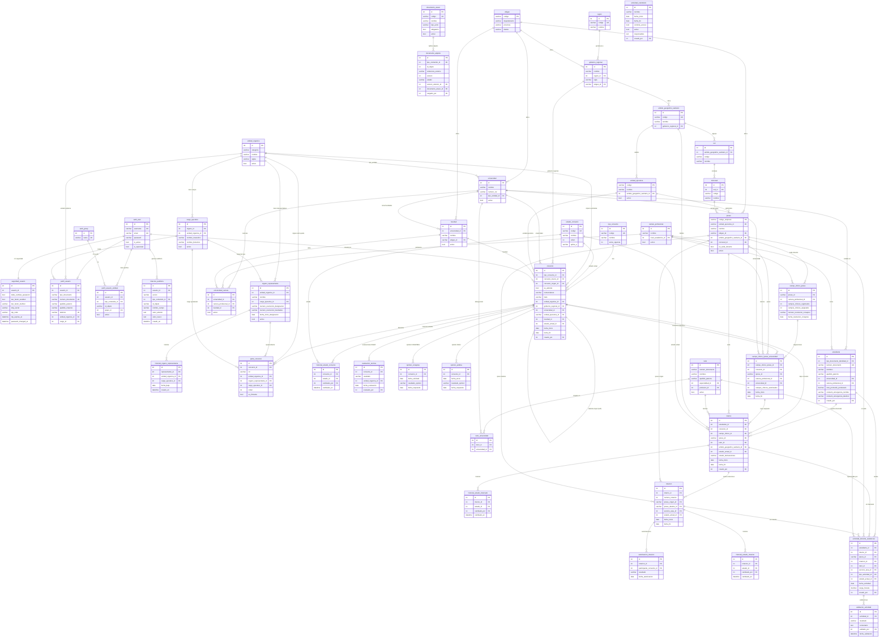

# RENADS — Diagrama Entidad-Relación

```mermaid
erDiagram

%% ══════════════════════════════════════════════════════
%%  MÓDULO 0 — SEGURIDAD / COMÚN
%% ══════════════════════════════════════════════════════

    auth_user {
        int id PK
        varchar username UK
        varchar email UK
        varchar password
        bool is_active
        bool is_superuser
    }

    auth_group {
        int id PK
        varchar name UK
    }

    seguridad_usuario {
        int id PK
        int usuario_id FK
        bool debe_cambiar_password
        bool two_factor_enabled
        varchar two_factor_method
        varchar totp_secret
        varchar otp_code
        datetime otp_expires_at
        datetime password_changed_at
    }

    perfil_usuario {
        int id PK
        int usuario_id FK
        varchar tipo_documento
        varchar numero_documento UK
        varchar apellido_paterno
        varchar apellido_materno
        varchar telefono UK
        int unidad_organica_id FK
        int cargo_id FK
    }

    perfil_usuario_entidad {
        int id PK
        int usuario_id FK
        int tipo_contenido_id FK
        varchar id_objeto
        int grupo_id FK
        bool activo
    }

    bitacora_auditoria {
        int id PK
        int usuario_id FK
        varchar accion
        int tipo_contenido_id FK
        varchar id_objeto
        varchar nombre_campo
        text valor_anterior
        text valor_nuevo
        datetime creado_en
    }

    documento_adjunto {
        int id PK
        int tipo_contenido_id FK
        int id_objeto
        varchar referencia_externa
        int version
        varchar estado
        int version_anterior_id FK
        int documento_anexo_id FK
        int cargado_por FK
    }

    documento_anexo {
        int id PK
        varchar codigo UK
        varchar nombre
        varchar tipo_actor
        bool obligatorio
        bool activo
    }

%% ══════════════════════════════════════════════════════
%%  MÓDULO 1 — CONVENIOS: Catálogos geográficos
%% ══════════════════════════════════════════════════════

    ubigeo {
        varchar codigo PK
        varchar departamento
        varchar provincia
        varchar distrito
    }

    region {
        int id PK
        varchar codigo UK
        varchar nombre
    }

    gobierno_regional {
        int id PK
        varchar nombre
        int region_id FK
        varchar sigla
        varchar ubigeo_id FK
    }

    ambito_geografico_sanitario {
        int id PK
        varchar codigo UK
        varchar nombre
        int gobierno_regional_id FK
    }

    red {
        int id PK
        int ambito_geografico_sanitario_id FK
        varchar codigo
        varchar nombre
    }

    microred {
        int id PK
        int red_id FK
        varchar codigo
        varchar nombre
    }

%% ══════════════════════════════════════════════════════
%%  MÓDULO 1 — CONVENIOS: Directorio institucional
%% ══════════════════════════════════════════════════════

    unidad_organica {
        int id PK
        varchar categoria
        varchar nombre
        varchar siglas
        bool activo
    }

    cargo_ejecutivo {
        int id PK
        int organo_id FK
        int unidad_organica_id FK
        varchar nombre_masculino
        varchar nombre_femenino
        bool activo
    }

    organo_representante {
        int id PK
        int unidad_organica_id FK
        varchar nombre
        int cargo_ejecutivo_id FK
        varchar numero_resolucion_designacion
        varchar numero_resolucion_facultades
        date fecha_inicio_designacion
        bool activo
    }

    historial_organo_representante {
        int id PK
        int representante_id FK
        int unidad_organica_id FK
        int cargo_ejecutivo_id FK
        date fecha_baja
        datetime creado_en
    }

%% ══════════════════════════════════════════════════════
%%  MÓDULO 1 — CONVENIOS: Entidades académicas
%% ══════════════════════════════════════════════════════

    universidad {
        int id PK
        varchar nombre
        varchar numero_ruc
        int tipo_entidad_id FK
        bool activo
    }

    facultad {
        int id PK
        int universidad_id FK
        varchar nombre
        varchar ubigeo_id FK
        bool activo
    }

    carrera_profesional {
        int id PK
        varchar nombre
        int nivel_academico_id FK
        bool activo
    }

    universidad_carrera {
        int id PK
        int universidad_id FK
        int carrera_profesional_id FK
        int facultad_id FK
        bool activo
    }

%% ══════════════════════════════════════════════════════
%%  MÓDULO 1 — CONVENIOS: IPRESS y unidades
%% ══════════════════════════════════════════════════════

    unidad_ejecutora {
        varchar codigo PK
        varchar nombre
        int ambito_geografico_sanitario_id FK
        bool activo
    }

    ipress {
        varchar codigo_renipress PK
        varchar unidad_ejecutora_id FK
        varchar nombre
        varchar ubigeo_id FK
        int ambito_geografico_sanitario_id FK
        int microred_id FK
        bool es_sede_docente
        bool activo
    }

%% ══════════════════════════════════════════════════════
%%  MÓDULO 1 — CONVENIOS: Núcleo del convenio
%% ══════════════════════════════════════════════════════

    tipo_convenio {
        int id PK
        varchar codigo UK
        varchar nombre
        int anios_vigencia
    }

    estado_convenio {
        int id PK
        varchar codigo UK
        varchar nombre
        int orden
        varchar aplica_a
    }

    convenio {
        int id PK
        int tipo_convenio_id FK
        int convenio_marco_id FK
        int convenio_origen_id FK
        bool es_adenda
        varchar nomenclatura
        varchar titulo
        int unidad_organica_id FK
        int gobierno_regional_id FK
        int universidad_id FK
        varchar unidad_ejecutora_id FK
        int facultad_id FK
        int estado_actual_id FK
        date fecha_inicio
        date fecha_fin
        int creado_por FK
    }

    parte_convenio {
        int id PK
        int convenio_id FK
        varchar rol
        int unidad_organica_id FK
        int organo_representante_id FK
        int cargo_ejecutivo_id FK
        int orden
        bool es_firmante
    }

    historial_estado_convenio {
        int id PK
        int convenio_id FK
        int estado_id FK
        int cambiado_por FK
        datetime cambiado_en
    }

    evaluacion_tecnica {
        int id PK
        int convenio_id FK
        varchar resultado
        int unidad_organica_id FK
        date fecha_evaluacion
        int evaluado_por FK
    }

    opinion_conapres {
        int id PK
        int convenio_id FK
        date fecha_solicitud
        varchar resultado_opinion
        date fecha_respuesta
    }

    opinion_juridica {
        int id PK
        int convenio_id FK
        date fecha_envio
        varchar resultado_opinion
        date fecha_respuesta
    }

%% ══════════════════════════════════════════════════════
%%  MÓDULO 1 — Campos clínicos
%% ══════════════════════════════════════════════════════

    campo_clinico_ipress {
        int id PK
        varchar ipress_id FK
        int carrera_profesional_id FK
        int campos_clinicos_registrados
        int campos_clinicos_asignados
        varchar numero_resolucion_conapres
        date fecha_resolucion_conapres
    }

    campo_clinico_ipress_universidad {
        int id PK
        int campo_clinico_ipress_id FK
        int convenio_id FK
        varchar ipress_id FK
        int carrera_profesional_id FK
        int universidad_id FK
        int campos_clinicos_autorizados
        date fecha_inicio
        date fecha_fin
    }

%% ══════════════════════════════════════════════════════
%%  MÓDULO 2 — INTERNADOS
%% ══════════════════════════════════════════════════════

    estudiante {
        int id PK
        int tipo_documento_identidad_id FK
        varchar numero_documento UK
        varchar nombres
        varchar apellido_paterno
        int universidad_id FK
        int carrera_profesional_id FK
        decimal nota_promedio_ponderado
        varchar contacto_emergencia_nombre
        varchar contacto_emergencia_telefono
        int creado_por FK
    }

    tutor {
        int id PK
        varchar numero_documento
        varchar nombres
        varchar apellido_paterno
        int especialidad_id FK
        int profesion_id FK
        bool activo
    }

    tutor_universidad {
        int id PK
        int tutor_id FK
        int universidad_id FK
    }

    interno {
        int id PK
        int estudiante_id FK
        int convenio_id FK
        int campo_clinico_id FK
        varchar ipress_id FK
        int tutor_id FK
        int ambito_geografico_sanitario_id FK
        int estado_actual_id FK
        varchar estado_declaraciones
        date fecha_inicio
        date fecha_fin
        int creado_por FK
    }

    historial_estado_internado {
        int id PK
        int interno_id FK
        int estado_id FK
        int cambiado_por FK
        datetime cambiado_en
    }

    rotacion {
        int id PK
        int interno_id FK
        int numero_rotacion
        varchar ipress_origen_id FK
        varchar ipress_destino_id FK
        int servicio_area_id FK
        int estado_actual_id FK
        date fecha_inicio
        date fecha_fin
    }

    autorizacion_rotacion {
        int id PK
        int rotacion_id FK
        int participante_convenio_id FK
        varchar resultado
        date fecha_autorizacion
    }

    historial_estado_rotacion {
        int id PK
        int rotacion_id FK
        int estado_id FK
        int cambiado_por FK
        datetime cambiado_en
    }

%% ══════════════════════════════════════════════════════
%%  MÓDULO 3 — ACTIVIDADES
%% ══════════════════════════════════════════════════════

    actividad_docente_asistencial {
        int id PK
        int estudiante_id FK
        int interno_id FK
        varchar ipress_id FK
        int rotacion_id FK
        int tutor_id FK
        int servicio_area_id FK
        int tipo_actividad_id FK
        int estado_actual_id FK
        date fecha_actividad
        decimal carga_horaria
        int creado_por FK
    }

    validacion_actividad {
        int id PK
        int actividad_id FK
        varchar resultado
        text comentario
        int validado_por FK
        datetime fecha_validacion
    }

%% ══════════════════════════════════════════════════════
%%  MÓDULO 4 — CALENDARIO
%% ══════════════════════════════════════════════════════

    actividad_calendario {
        int id PK
        varchar nombre
        date fecha_inicio
        date fecha_fin
        bool controla_acceso
        bool activo
        text responsables
        int creado_por FK
    }

%% ══════════════════════════════════════════════════════
%%  RELACIONES
%% ══════════════════════════════════════════════════════

    %% Auth / Seguridad
    auth_user ||--|| seguridad_usuario : "1:1 seguridad"
    auth_user ||--o| perfil_usuario : "1:1 perfil"
    auth_user ||--o{ perfil_usuario_entidad : "tiene perfiles"
    auth_group ||--o{ perfil_usuario_entidad : "rol"
    auth_user ||--o{ bitacora_auditoria : "genera auditoría"
    documento_anexo ||--o{ documento_adjunto : "tipifica adjunto"

    %% Perfil usuario → directorio
    unidad_organica ||--o{ perfil_usuario : "unidad orgánica"
    cargo_ejecutivo ||--o{ perfil_usuario : "cargo"

    %% Geografía
    region ||--o{ gobierno_regional : "pertenece a"
    gobierno_regional ||--o{ ambito_geografico_sanitario : "cubre"
    ambito_geografico_sanitario ||--o{ red : "agrupa"
    red ||--o{ microred : "contiene"
    ubigeo ||--o{ gobierno_regional : "ubica"
    ubigeo ||--o{ ipress : "ubica"
    ubigeo ||--o{ universidad : "ubica"
    ubigeo ||--o{ facultad : "ubica"

    %% Directorio institucional
    unidad_organica ||--o{ cargo_ejecutivo : "tiene cargos"
    unidad_organica ||--o{ organo_representante : "tiene representantes"
    cargo_ejecutivo ||--o{ organo_representante : "cargo del rep."
    organo_representante ||--o{ historial_organo_representante : "historial"

    %% Entidades académicas
    unidad_organica ||--o{ universidad : "tipo_entidad"
    universidad ||--o{ facultad : "tiene facultades"
    universidad ||--o{ universidad_carrera : "carreras"
    carrera_profesional ||--o{ universidad_carrera : "pertenece"
    facultad ||--o{ universidad_carrera : "dicta"

    %% IPRESS y unidades
    ambito_geografico_sanitario ||--o{ unidad_ejecutora : "ámbito"
    unidad_ejecutora ||--o{ ipress : "administra"
    microred ||--o{ ipress : "red de salud"

    %% Convenio núcleo
    tipo_convenio ||--o{ convenio : "tipo"
    estado_convenio ||--o{ convenio : "estado actual"
    convenio ||--o{ convenio : "convenio marco (self)"
    convenio ||--o{ convenio : "adenda origen (self)"
    unidad_organica ||--o{ convenio : "órgano solicitante"
    gobierno_regional ||--o{ convenio : "gobierno regional"
    universidad ||--o{ convenio : "universidad"
    unidad_ejecutora ||--o{ convenio : "unidad ejecutora"
    facultad ||--o{ convenio : "facultad"
    auth_user ||--o{ convenio : "creado por"

    %% Partes y estados convenio
    convenio ||--o{ parte_convenio : "firmantes"
    unidad_organica ||--o{ parte_convenio : "órgano de la parte"
    organo_representante ||--o{ parte_convenio : "representante"
    cargo_ejecutivo ||--o{ parte_convenio : "cargo apoderado"
    convenio ||--o{ historial_estado_convenio : "historial estados"
    estado_convenio ||--o{ historial_estado_convenio : "estado"

    %% Evaluaciones y opiniones
    convenio ||--o{ evaluacion_tecnica : "evaluaciones DIGEP"
    convenio ||--o{ opinion_conapres : "opinión CONAPRES"
    convenio ||--o{ opinion_juridica : "opinión OGAJ"

    %% Campos clínicos
    ipress ||--o{ campo_clinico_ipress : "sede docente"
    carrera_profesional ||--o{ campo_clinico_ipress : "por carrera"
    campo_clinico_ipress ||--o{ campo_clinico_ipress_universidad : "asignaciones"
    convenio ||--o{ campo_clinico_ipress_universidad : "convenio específico"
    ipress ||--o{ campo_clinico_ipress_universidad : "ipress"
    carrera_profesional ||--o{ campo_clinico_ipress_universidad : "carrera"
    universidad ||--o{ campo_clinico_ipress_universidad : "universidad"

    %% Internados
    estudiante ||--o{ interno : "registra internado"
    convenio ||--o{ interno : "bajo convenio"
    campo_clinico_ipress_universidad ||--o{ interno : "cupo asignado"
    ipress ||--o{ interno : "sede"
    tutor ||--o{ interno : "tutoriza"
    ambito_geografico_sanitario ||--o{ interno : "ámbito"
    estado_convenio ||--o{ interno : "estado actual"

    %% Tutor
    tutor ||--o{ tutor_universidad : "imparte en"
    universidad ||--o{ tutor_universidad : "alberga tutor"

    %% Estudiante refs
    universidad ||--o{ estudiante : "estudia en"
    carrera_profesional ||--o{ estudiante : "cursa"

    %% Rotaciones
    interno ||--o{ rotacion : "realiza rotaciones"
    ipress ||--o{ rotacion : "ipress origen"
    ipress ||--o{ rotacion : "ipress destino"
    rotacion ||--o{ autorizacion_rotacion : "autorizaciones"
    rotacion ||--o{ historial_estado_rotacion : "historial"
    interno ||--o{ historial_estado_internado : "historial"

    %% Actividades
    estudiante ||--o{ actividad_docente_asistencial : "realiza"
    interno ||--o{ actividad_docente_asistencial : "en internado"
    ipress ||--o{ actividad_docente_asistencial : "en sede"
    rotacion ||--o{ actividad_docente_asistencial : "en rotación"
    tutor ||--o{ actividad_docente_asistencial : "supervisada por"
    actividad_docente_asistencial ||--o{ validacion_actividad : "validaciones"
```
