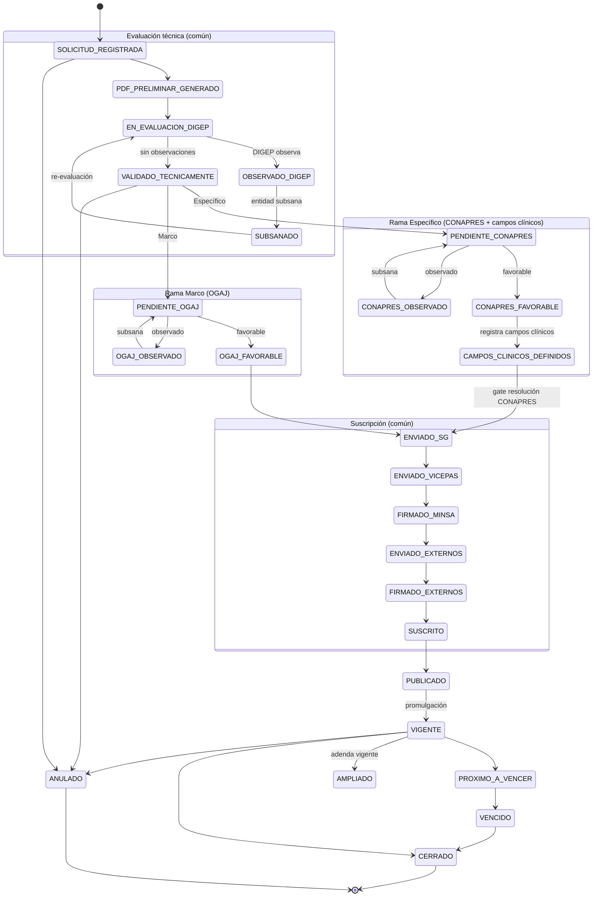

# Flujo de convenios — solicitud → promulgación

Documento de referencia del ciclo de vida de un **Convenio Marco** y un **Convenio
Específico** en el módulo *Gestionar Convenios*, desde el registro de la solicitud
hasta su promulgación (publicación/vigencia) y estados posteriores.

## Fuentes de verdad

| Qué | Dónde |
|-----|-------|
| Estados (26, `codigo/nombre/aplica_a/orden`) | Seed `apps/convenios/migrations/0002_seed_catalogos.py` (`CONVENTION_STATUSES`) → tabla `estado_convenio` (`ConventionStatus`) |
| Máquina de transición | `apps/convenios/services.py` — `_set_estado`, `_avanzar_estado`, `cambiar_estado`, `registrar_firma`, `registrar_opinion_*`, `publicar` |
| Reglas de negocio | `CLAUDE.md` §"Reglas del módulo Gestionar Convenios" |
| Esquema de datos | `docs/db_schema_modulo_01_convenios.md` |

Cada convenio guarda `estado_actual` (FK a `estado_convenio`) y su bitácora en
`estado_convenio_historial` (`ConventionStatusHistory`) + auditoría. El campo
`aplica_a` discrimina `TODOS` vs `ESPECIFICO`: un estado `ESPECIFICO` no puede fijarse
en un Marco (`_set_estado` lo bloquea). Las transiciones automáticas usan
`_avanzar_estado` (**forward-only** por `orden`, idempotente: nunca retrocede).

## Catálogo de estados

| Orden | Código | Nombre | Aplica a |
|------:|--------|--------|----------|
| 1 | `SOLICITUD_REGISTRADA` | Solicitud registrada | TODOS |
| 2 | `PDF_PRELIMINAR_GENERADO` | PDF preliminar generado | TODOS |
| 3 | `EN_EVALUACION_DIGEP` | En evaluación técnica DIGEP | TODOS |
| 4 | `OBSERVADO_DIGEP` | Observado por DIGEP | TODOS |
| 5 | `SUBSANADO` | Subsanado por entidad solicitante | TODOS |
| 6 | `VALIDADO_TECNICAMENTE` | Validado técnicamente | TODOS |
| 7 | `PENDIENTE_CONAPRES` | Pendiente de opinión CONAPRES | ESPECIFICO |
| 8 | `CONAPRES_FAVORABLE` | Opinión CONAPRES favorable | ESPECIFICO |
| 9 | `CONAPRES_OBSERVADO` | Opinión CONAPRES observada | ESPECIFICO |
| 10 | `CAMPOS_CLINICOS_DEFINIDOS` | Campos clínicos definidos | ESPECIFICO |
| 11 | `PENDIENTE_OGAJ` | Pendiente de opinión OGAJ | TODOS (solo Marco por RN) |
| 12 | `OGAJ_FAVORABLE` | Opinión jurídica favorable | TODOS (solo Marco por RN) |
| 13 | `OGAJ_OBSERVADO` | Opinión jurídica observada | TODOS (solo Marco por RN) |
| 14 | `ENVIADO_SG` | Enviado a Secretaría General | TODOS |
| 15 | `ENVIADO_VICEPAS` | Enviado a Despacho VICEPAS | TODOS |
| 16 | `FIRMADO_MINSA` | Firmado por MINSA | TODOS |
| 17 | `ENVIADO_EXTERNOS` | Enviado a entidades externas | TODOS |
| 18 | `FIRMADO_EXTERNOS` | Firmado por entidades externas | TODOS |
| 19 | `SUSCRITO` | Suscrito | TODOS |
| 20 | `PUBLICADO` | Publicado | TODOS |
| 21 | `VIGENTE` | Vigente | TODOS |
| 22 | `PROXIMO_A_VENCER` | Próximo a vencer | TODOS |
| 23 | `VENCIDO` | Vencido | TODOS |
| 24 | `AMPLIADO` | Ampliado | TODOS |
| 25 | `CERRADO` | Cerrado | TODOS |
| 26 | `ANULADO` | Anulado | TODOS |

## Etapas del flujo

### 1. Registro y evaluación técnica (común, orden 1-6)

```
SOLICITUD_REGISTRADA → PDF_PRELIMINAR_GENERADO → EN_EVALUACION_DIGEP
    ⇄ OBSERVADO_DIGEP → SUBSANADO → (re-evaluación)
→ VALIDADO_TECNICAMENTE
```

- `crear_convenio` fija `SOLICITUD_REGISTRADA`.
- **RN-1**: solo `organo_directorio.categoria == GOBIERNO_REGIONAL` (GERESA/DIRESA)
  puede solicitar un **Marco**; **DIRIS** (`MINSA_DIRIS`) está exenta de Marco.
- **Partes por tipo** (`_validar_partes_por_tipo`): el Marco no lleva
  `unidad_ejecutora`/`facultad`; el Específico exige ambos (la `facultad` debe
  pertenecer a la universidad del Marco).
- **Partes firmantes (`parte_convenio`):** la solicitud captura las partes que suscriben,
  por `rol` (`MINSA`/`UNIVERSIDAD`/`GOBIERNO_REGIONAL`/`UNIDAD_EJECUTORA`/`FACULTAD`), cada
  una con `organo_directorio` + `organo_representante` + `cargo_ejecutivo`. Composición
  requerida (`services._validar_composicion_partes`): Marco Lima (`MINSA_DIRIS`) ⇒
  MINSA+UNIVERSIDAD; Marco región (`GOBIERNO_REGIONAL`) ⇒ MINSA+GOBIERNO_REGIONAL+UNIVERSIDAD;
  Específico ⇒ UNIDAD_EJECUTORA+FACULTAD (apoderado `orden=2` opcional). Se sincronizan vía
  `POST /api/v1/conventions/{id}/parties` (`services.sincronizar_partes`). Las resoluciones de
  designación y de facultades del firmante se derivan de `organo_representante`
  (`numero_resolucion_designacion` + `numero_resolucion_facultades`).
- El Específico vincula los `campo_clinico_ipress` (determinación CONAPRES) de las sedes de su
  unidad ejecutora, filtrados por las carreras de su facultad
  (`selectors.campos_clinicos_del_especifico`).
- DIGEP evalúa; si observa → `OBSERVADO_DIGEP`, la entidad subsana (`SUBSANADO`) y se
  re-evalúa. Sin observaciones → `VALIDADO_TECNICAMENTE`.
- **Nomenclatura (solo Marco):** el campo `nomenclatura` (reemplaza a `codigo`) se asigna al
  aprobar DIGEP — en `registrar_evaluacion_tecnica` con `resultado=VALIDADO`, antes de fijar
  `VALIDADO_TECNICAMENTE` y previo a `PENDIENTE_OGAJ` (gate `services._validar_nomenclatura`).
  No es editable por PATCH libre.

### 2A. Rama Convenio Específico (orden 7-10)

```
VALIDADO_TECNICAMENTE → PENDIENTE_CONAPRES
    → CONAPRES_FAVORABLE   (⇄ CONAPRES_OBSERVADO)
→ CAMPOS_CLINICOS_DEFINIDOS
```

- **CONAPRES solo aplica al Específico**. Emite opinión favorable u observa.
- Registrar un `campo_clinico_ipress` avanza a `CAMPOS_CLINICOS_DEFINIDOS`
  (`services._avanzar_estado`, forward-only).
- El Específico **no** pasa por OGAJ.

### 2B. Rama Convenio Marco (orden 11-13)

```
VALIDADO_TECNICAMENTE → PENDIENTE_OGAJ
    → OGAJ_FAVORABLE   (⇄ OGAJ_OBSERVADO)
```

- **La opinión jurídica OGAJ solo aplica al Marco**. Favorable u observada.
- El Marco **no** pasa por CONAPRES ni campos clínicos.

### 3. Suscripción (común, orden 14-19)

```
ENVIADO_SG → ENVIADO_VICEPAS → FIRMADO_MINSA
    → ENVIADO_EXTERNOS → FIRMADO_EXTERNOS → SUSCRITO
```

- **Gate a `ENVIADO_SG`** (`services._exigir_campos_clinicos_conapres`): un
  **Específico** no avanza a suscripción sin ≥1 `campo_clinico_ipress` con
  `numero_resolucion_conapres` sobre una sede docente (`ipress.es_sede_docente=True`)
  de la unidad ejecutora del convenio.
- Firmas vía `registrar_firma` (`FIRMADO_MINSA`, `FIRMADO_EXTERNOS`).

### 4. Promulgación (común, orden 20-21)

```
PUBLICADO → VIGENTE
```

- `VIGENTE` = convenio operativo (habilita internados/actividades sobre él).
- Al pasar una **adenda** a `VIGENTE`, su `convenio_origen` se marca `AMPLIADO`
  (salvo que ya esté `CERRADO`/`ANULADO`/`AMPLIADO`). La vigencia efectiva
  (`selectors.vigencia_efectiva`) toma la mayor `fecha_fin` de las adendas vigentes.

### 5. Estados posteriores (orden 22-26)

`PROXIMO_A_VENCER` · `VENCIDO` · `AMPLIADO` (por adenda) · `CERRADO` · `ANULADO`.

## Generación de documentos (proyecto + expediente)

`apps/convenios/pdf.py` genera el **proyecto de convenio** rellenando la plantilla Word
correspondiente (docxtpl) y convirtiéndola a PDF con **LibreOffice headless**. La plantilla se
elige de forma determinista por `(tipo_convenio, es_adenda, organo_directorio.categoria)`:

| Plantilla | Caso |
|-----------|------|
| `modelo_1_marco_lima` | Marco, Lima (`MINSA_DIRIS`) — MINSA + Universidad |
| `modelo_2_marco_region` | Marco, región (`GOBIERNO_REGIONAL`) — MINSA + GORE + Universidad |
| `modelo_3_especifico_lima` | Específico, Lima — UE/DIRIS + Facultad (opinión CONAPRES) |
| `modelo_4_especifico_region` | Específico, región — UE + Facultad (opinión COREPRES) |
| `adenda` | Adenda (Marco o Específico) — sobre `convenio_origen` |

`construir_contexto` toma los datos de `partes_firmantes` (razón social, RUC, domicilio — MINSA
fijo Av. Salaverry 801), `nomenclatura`, carreras de la facultad y campos clínicos del
Específico. Endpoints:

- `POST /api/v1/conventions/{id}/generar-proyecto` → anexo `PROYECTO_CONVENIO`/`PROYECTO_ADENDA`.
- `POST /api/v1/conventions/{id}/generar-expediente` → anexo `EXPEDIENTE` (merge con pypdf del
  proyecto + resoluciones de los firmantes + tabla de campos clínicos).

Ambos suben al storage (**Cloudflare R2**) y versionan vía `adjuntar_documento`; son escritura
y pasan el gate `IsModuleEnabled`.

## Diferencias Marco vs Específico

| | Convenio Marco | Convenio Específico |
|---|---|---|
| Solicita | GERESA/DIRESA (`GOBIERNO_REGIONAL`) | Universidad; requiere Marco vigente **salvo DIRIS** (exenta) |
| CONAPRES (7-10) | ❌ | ✅ opinión + campos clínicos |
| OGAJ (11-13) | ✅ | ❌ |
| Partes | sin `unidad_ejecutora`/`facultad` | ambos obligatorios (`facultad` de la universidad del Marco) |
| Gate a suscripción | — | resolución CONAPRES en campos clínicos |

## Diagrama de estados (Mermaid)



> El diagrama muestra el camino nominal y los principales bucles de observación. Las
> transiciones a `ANULADO` pueden ocurrir desde la mayoría de estados no terminales
> (se ilustran algunas); `PROXIMO_A_VENCER`/`VENCIDO` derivan de la vigencia temporal.
